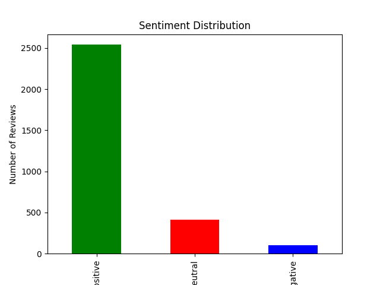
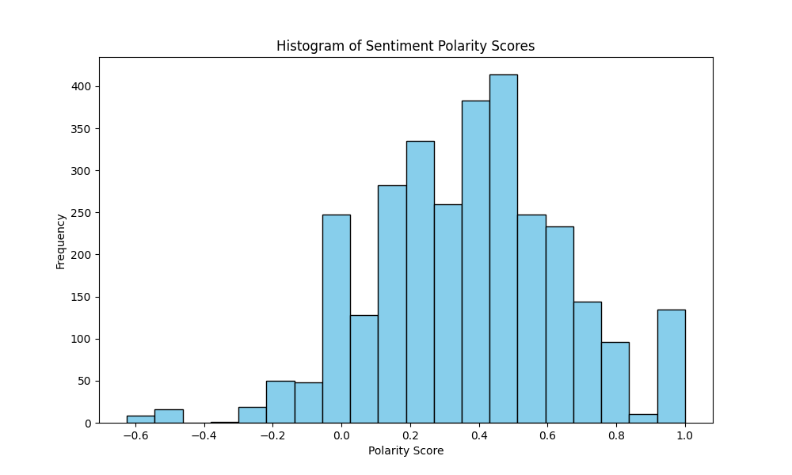
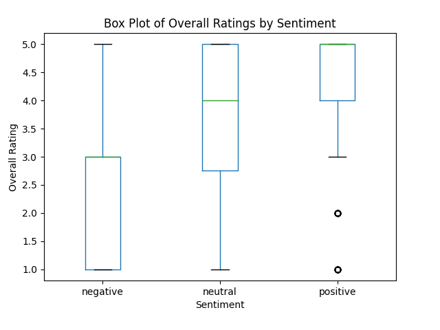
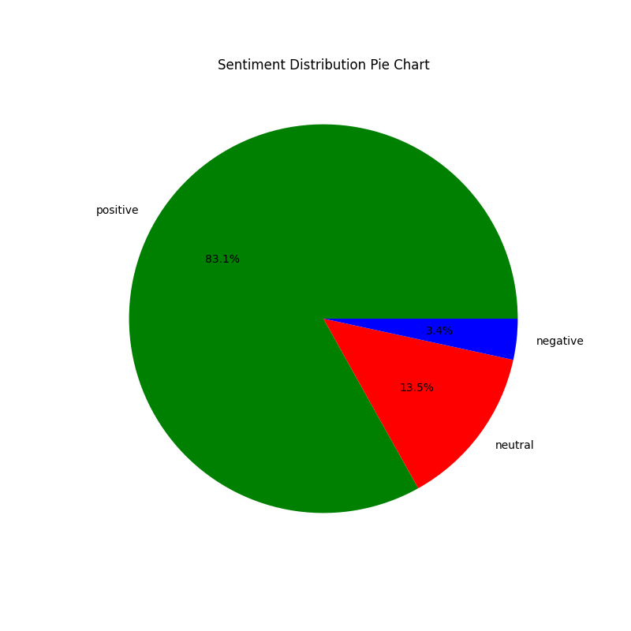

<<<<<<< HEAD


## 📊 Project Overview

This project performs **sentiment analysis** on Amazon product reviews to understand customer opinions and feedback. Using Python libraries like Pandas, TextBlob, and Matplotlib, the project analyzes review text to determine whether customers express positive, negative, or neutral sentiments, and compares these sentiments with numerical product ratings.

## 🎯 Objectives

The main objectives of this project are:
1. **Analyze Customer Sentiments**: Automatically classify Amazon product reviews as positive, negative, or neutral based on the text content.
2. **Correlation Analysis**: Examine how sentiment polarity correlates with numerical product ratings (1-5 stars).
3. **Data Visualization**: Create meaningful visualizations to better understand the distribution of sentiments and ratings.
4. **Insight Generation**: Provide actionable insights about customer satisfaction levels.

## 🛠️ Technologies Used

| Technology | Purpose |
|------------|---------|
| **Python** | Programming language |
| **Pandas** | Data manipulation and analysis |
| **TextBlob** | Natural Language Processing (NLP) for sentiment analysis |
| **Matplotlib** | Data visualization |

### Dependencies

Install all required dependencies with:
```
bash
pip install pandas textblob matplotlib
```

## 📁 Project Structure

```
Amazon Sentiment Analysis/
├── amazon.csv                  # Dataset containing Amazon product reviews
├── sentiment_analysis.py       # Python script for sentiment analysis
├── sentimentanalysis.ipynb     # Jupyter notebook with detailed analysis
├── README.md                   # This file
├── TODO.md                     # Project task tracking
├── sentiment_distribution.png  # Bar chart of sentiment distribution
├── polarity_histogram.png      # Histogram of polarity scores
├── ratings_boxplot.png         # Box plot of ratings by sentiment
└── sentiment_pie.png           # Pie chart of sentiment distribution
```

## 📊 Dataset Description

The dataset `amazon.csv` contains Amazon product reviews with the following columns:

| Column | Description |
|--------|-------------|
| `asin` | Amazon Standard Identification Number (Product ID) |
| `reviewText` | The actual text content of the customer review |
| `overall` | Numerical rating from 1 to 5 stars |
| `category` | Product category |
| `summary` | Brief summary of the review |

### Sample Data Preview

The dataset contains thousands of Amazon product reviews spanning various categories. Each review includes both textual feedback and a numerical rating, allowing for comparative analysis between expressed sentiment and actual ratings.

## 🔬 Methodology

### Step-by-Step Process

1. **Data Loading**
   - Load the Amazon reviews dataset from `amazon.csv` using Pandas

2. **Data Cleaning**
   - Remove rows with missing or null `reviewText` values
   - Ensure all reviews have valid text content for analysis

3. **Sentiment Analysis**
   - Use TextBlob's NLP capabilities to compute sentiment polarity for each review
   - Polarity scores range from -1 (most negative) to +1 (most positive)

4. **Sentiment Classification**
   - Classify each review into three categories:
     - **Positive**: polarity > 0.1
     - **Negative**: polarity < -0.1
     - **Neutral**: -0.1 ≤ polarity ≤ 0.1

5. **Comparative Analysis**
   - Group reviews by sentiment classification
   - Calculate average ratings for each sentiment category
   - Examine the relationship between text sentiment and numerical ratings

6. **Visualization**
   - Generate multiple charts to visualize the analysis results

## 📈 Visualizations

### 1. Sentiment Distribution Bar Chart


This bar chart shows the count of reviews in each sentiment category (positive, negative, neutral). It provides a quick overview of overall customer sentiment distribution.

### 2. Polarity Score Histogram


This histogram displays the distribution of sentiment polarity scores across all reviews. The x-axis represents polarity scores (-1 to +1), and the y-axis shows the frequency of reviews at each score level.

### 3. Ratings Box Plot by Sentiment


This box plot compares the distribution of numerical ratings (1-5 stars) across different sentiment categories. It helps visualize:
- Median ratings for each sentiment
- Spread/range of ratings
- Outliers in the data

### 4. Sentiment Distribution Pie Chart


This pie chart shows the percentage breakdown of positive, negative, and neutral sentiments in the dataset.

## 📋 Results & Insights

### Key Findings

The analysis outputs:
- **Average Rating by Sentiment**: Shows how different sentiment categories correspond to numerical ratings
- **Sentiment Distribution**: Understanding the overall customer satisfaction landscape
- **Polarity Distribution**: Insights into how strongly customers feel (positive or negative)

### Sample Output

```
Average rating by sentiment:
sentiment
negative    X.XX
neutral     X.XX
positive    X.XX
```


## 🔍 How Sentiment Analysis Works

### TextBlob Sentiment Analysis

TextBlob is a Python library that provides a simple API for diving into common natural language processing (NLP) tasks. For sentiment analysis:

1. **Tokenization**: Breaks text into words and sentences
2. **Part-of-speech Taging**: Identifies nouns, verbs, adjectives, etc.
3. **Noun Phrase Extraction**: Identifies key noun phrases
4. **Sentiment Analysis**: Returns polarity and subjectivity scores

### Polarity Score Interpretation

| Polarity Range | Interpretation |
|----------------|----------------|
| > 0.1 | Positive sentiment |
| -0.1 to 0.1 | Neutral sentiment |
| < -0.1 | Negative sentiment |


=======


>>>>>>> 51dfbd044ef738461ca3508029773f9d366e6274
